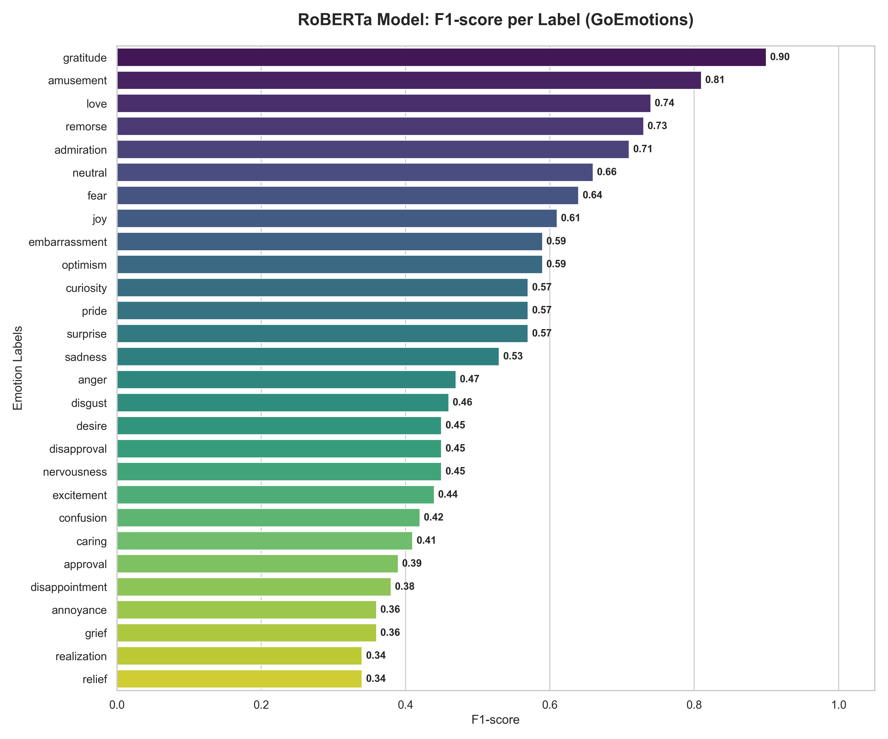

# Multi-label Emotion Classification with RoBERTa

Fine-tuning RoBERTa-base on the GoEmotions dataset for multi-label emotion classification across 28 emotion categories.

## Overview

This project fine-tunes `roberta-base` to detect multiple emotions simultaneously from short English texts (Reddit comments). The model addresses class imbalance using Focal Loss and optimizes per-label thresholds dynamically.

## Dataset

[GoEmotions](https://github.com/google-research/google-research/tree/master/goemotions) — A dataset of 58k Reddit comments labeled with 28 emotions (e.g., admiration, anger, joy, sadness, ...).

## Approach

- **Model:** RoBERTa-base fine-tuned for multi-label sequence classification
- **Loss Function:** Focal Loss (α=1, γ=2) to handle class imbalance
- **Threshold Optimization:** Dynamic per-label threshold tuning on validation set instead of fixed 0.5
- **Tokenizer:** Extended with special tokens `[NAME]`, `[RELIGION]` for Reddit-specific text
- **Experiment Tracking:** Weights & Biases (WandB)

## Training

### Configuration
Key hyperparameters defined in `config` at the top of the notebook:

| Parameter | Value |
|-----------|-------|
| Model | `roberta-base` |
| Max sequence length | 128 |
| Batch size | 16 |
| Epochs | 6 |
| Learning rate | 2e-5 |
| Weight decay | 0.01 |
| Focal Loss α | 1 |
| Focal Loss γ | 2 |

### Steps

**1. Preprocess**
Text cleaning applied to all splits:
- Emoji converted to text via `emoji.demojize()`
- URLs removed

**2. Tokenize & Split**
- Tokenizer extended with special tokens `[NAME]`, `[RELIGION]`
- Stratified split using `MultilabelStratifiedShuffleSplit` to preserve label distribution

**3. Fine-tune model RoBERTa**
- Fine-tune `roberta-base` using Hugging Face `Trainer` API with `TrainingArguments`
- Focal Loss replaces standard BCE to down-weight easy negatives and focus on hard samples
- Early stopping applied to prevent overfitting
- Training progress tracked via WandB

**4. Threshold Optimization**
After training, per-label thresholds are tuned on the validation set to maximize F1 per label, replacing the default fixed threshold of 0.5.

**5. Evaluate**
Final evaluation on the test set with dynamic thresholds, outputting full classification report and F1 chart per label.

## Results

Evaluated on the GoEmotions test set:
| Metric | Score |
|--------|-------|
| Macro F1 | 0.53 |
| Micro F1 | 0.58 |
| Weighted F1 | 0.59 |

